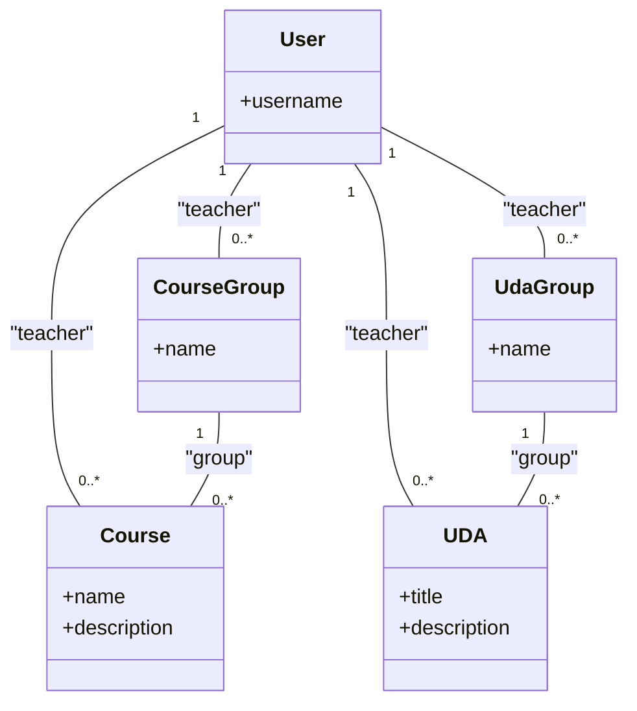

# Piano di Implementazione: Raggruppamento Corsi e UDA

Questo documento descrive il piano per estendere la funzionalità di raggruppamento, già presente per le Lezioni, ai Corsi e alle Unità di Apprendimento (UDA).

## 1. Obiettivo

L'obiettivo è consentire ai docenti di raggruppare logicamente i Corsi e le UDA in modo indipendente, migliorando l'organizzazione e la visualizzazione nelle rispettive interfacce.

## 2. Piano di Implementazione

Il piano è suddiviso in modifiche al backend (Django/DRF) e al frontend (Vue.js/Pinia/TypeScript).

### 2.1 Modifiche Backend (Django)

#### 2.1.1 Modelli (`apps/uda/models.py`)

1.  **Creare il modello `CourseGroup`**:
    *   Sarà un nuovo modello per rappresentare i gruppi di corsi.
    *   Avrà un campo `name` (CharField) e una `ForeignKey` al `teacher`.
    *   `unique_together = ('teacher', 'name')` per evitare nomi duplicati per lo stesso docente.

2.  **Creare il modello `UdaGroup`**:
    *   Sarà un nuovo modello per i gruppi di UDA.
    *   Avrà una struttura identica a `CourseGroup`: `name` e `teacher`.

3.  **Aggiornare il modello `Course`**:
    *   Aggiungere una `ForeignKey` opzionale (`null=True, blank=True`) al modello `CourseGroup`. Chiameremo il campo `group`.

4.  **Aggiornare il modello `UDA`**:
    *   Aggiungere una `ForeignKey` opzionale (`null=True, blank=True`) al modello `UdaGroup`. Chiameremo il campo `group`.

#### 2.1.2 Migrazioni

1.  **Creare la migrazione**: Eseguire `makemigrations` per creare il file di migrazione che aggiunge i nuovi modelli e aggiorna quelli esistenti.
2.  **Applicare la migrazione**: Eseguire `migrate` per applicare le modifiche al database.

#### 2.1.3 API (DRF)

1.  **Serializers (`apps/uda/serializers.py`)**:
    *   Creare `CourseGroupSerializer` per il modello `CourseGroup`.
    *   Creare `UdaGroupSerializer` per il modello `UdaGroup`.
    *   Aggiornare `CourseSerializer` per includere il campo `group` (sola lettura, annidato) e un campo `group_id` (scrivibile).
    *   Aggiornare `UDASerializer` per includere il campo `group` (sola lettura, annidato) e un campo `group_id` (scrivibile).

2.  **Viste (`apps/uda/views.py`)**:
    *   Creare `CourseGroupViewSet` per gestire le operazioni CRUD sui gruppi di corsi.
    *   Creare `UdaGroupViewSet` per gestire le operazioni CRUD sui gruppi di UDA.

3.  **URL (`apps/uda/urls.py`)**:
    *   Registrare i nuovi `CourseGroupViewSet` e `UdaGroupViewSet` nel router DRF per esporre i relativi endpoint API.

### 2.2 Modifiche Frontend (Vue.js)

#### 2.2.1 Tipi (TypeScript)

1.  **Creare nuove interfacce (`frontend-lessons/src/types/uda.ts`)**:
    *   Creare l'interfaccia `CourseGroup`.
    *   Creare l'interfaccia `UdaGroup`.

2.  **Aggiornare interfacce esistenti (`frontend-lessons/src/types/uda.ts`)**:
    *   Aggiornare l'interfaccia `Course` per includere il campo opzionale `group: CourseGroup | null`.
    *   Aggiornare l'interfaccia `UDA` per includere il campo opzionale `group: UdaGroup | null`.

#### 2.2.2 Store (Pinia)

Sarà necessario creare o aggiornare uno o più store Pinia (es. `courseStore.ts`, `udaStore.ts` o uno store più generico) per gestire lo stato dei gruppi.

1.  **Aggiungere nuovo stato**:
    *   Aggiungere `courseGroups`, `isLoadingCourseGroups`.
    *   Aggiungere `udaGroups`, `isLoadingUdaGroups`.

2.  **Aggiungere nuove azioni (Actions)**:
    *   Azioni CRUD per i gruppi di corsi (`fetchCourseGroups`, `createCourseGroup`, `deleteCourseGroup`, etc.).
    *   Azioni CRUD per i gruppi di UDA (`fetchUdaGroups`, `createUdaGroup`, `deleteUdaGroup`, etc.).
    *   Azioni per assegnare/rimuovere corsi e UDA dai rispettivi gruppi (`assignItemsToGroup`, `removeItemFromGroup`). La logica sarà generica e riutilizzabile.

#### 2.2.3 UI (Viste e Componenti)

Le modifiche si concentreranno probabilmente sulla vista principale dove vengono elencati i corsi e le UDA (es. `DashboardView.vue` o viste dedicate).

1.  **Aggiornare le viste di elenco**:
    *   Modificare la logica di rendering per visualizzare prima gli elementi raggruppati (sotto il rispettivo gruppo espandibile/collassabile) e poi gli elementi non raggruppati.
    *   Implementare la selezione multipla sia per i Corsi che per le UDA.

2.  **Creare componenti modali riutilizzabili**:
    *   Una modale per la creazione/rinomina di un gruppo.
    *   Una modale per assegnare gli elementi selezionati a un gruppo nuovo o esistente.

3.  **Aggiungere controlli UI**:
    *   Pulsanti per espandere/collassare i gruppi.
    *   Pulsanti per eliminare un gruppo (con logica per sganciare gli elementi contenuti).
    *   Pulsante per rimuovere un singolo elemento da un gruppo.

## 3. Prossimi Passi

Chiedo la tua approvazione su questo piano. Se sei d'accordo, possiamo procedere con l'implementazione, iniziando dalle modifiche al backend.