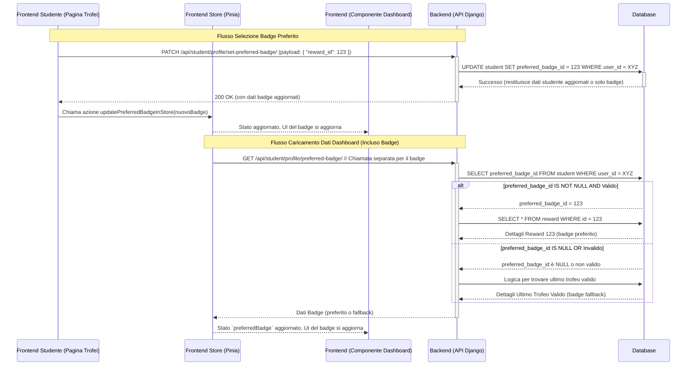

# Piano di Progettazione: Selezione Badge Preferito per Studenti

**Versione:** 1.0
**Data:** 24 Maggio 2025
**Autore:** Roo (Architect AI)

## 1. Obiettivo Principale

Consentire agli studenti di selezionare un "badge" (trofeo/ricompensa ottenuta) dalla loro collezione personale da visualizzare in una posizione prominente nella loro dashboard (attualmente identificata come "ultimo traguardo"). Questo offre agli studenti un maggiore controllo sulla personalizzazione della loro interfaccia.

## 2. Contesto e Riferimenti

Questa funzionalità si integra con il sistema di ricompense e la dashboard studente esistenti, come descritto nel file [`design_document.md`](design_document.md).

*   **Ricompense/Trofei:** Tabella `REWARD` (riga 386 del [`design_document.md`](design_document.md)).
*   **Profilo Studente:** Tabella `STUDENT` (riga 184 del [`design_document.md`](design_document.md)).
*   **Dashboard Studente API:** Il frontend attualmente utilizza endpoint specifici come `student/dashboard/quizzes/`, `student/dashboard/pathways/`, `student/dashboard/wallet/` e aggrega i dati. Non esiste un singolo endpoint `/api/student/dashboard/` che restituisce tutti i dati.

## 3. Modifiche Proposte

### 3.1. Backend (Django & DRF)

#### 3.1.1. Modello Dati

Si propone di modificare il modello `Student` per memorizzare la preferenza dell'utente.

*   **Tabella:** `apps.users.Student` (corrispondente a `STUDENT` nel [`design_document.md`](design_document.md))
*   **Nuovo Campo:**
    *   `preferred_badge`: `models.ForeignKey('rewards.Reward', on_delete=models.SET_NULL, null=True, blank=True, related_name='preferring_students', verbose_name="Badge Preferito")`
        *   `on_delete=models.SET_NULL`: Se il badge preferito viene eliminato (scenario improbabile per trofei guadagnati, ma sicuro), la preferenza dello studente viene semplicemente annullata (torna a `NULL`), e si applicherà la logica di fallback.
        *   `null=True, blank=True`: Lo studente potrebbe non avere una preferenza.

#### 3.1.2. Migrazione Database

Sarà generata una migrazione Django per aggiungere il nuovo campo `preferred_badge` al modello `Student`.

#### 3.1.3. API Endpoints

1.  **Impostare/Aggiornare Badge Preferito:**
    *   **Endpoint:** `PATCH /api/student/profile/set-preferred-badge/`
    *   **Metodo:** `PATCH`
    *   **Autenticazione:** Richiesta (solo studente autenticato può modificare il proprio profilo).
    *   **Payload Richiesto:**
        ```json
        {
          "reward_id": <ID_DELLA_RICOMPENSA_SCELTA> // Può essere null per deselezionare
        }
        ```
    *   **Logica del Serializer/View:**
        *   Validare che `reward_id` (se non nullo) corrisponda a una `Reward` esistente e che lo studente abbia effettivamente ottenuto tale ricompensa (questo potrebbe essere un controllo aggiuntivo se i "trofei" sono un sottoinsieme specifico delle `Reward` o se c'è una tabella di join che traccia i trofei guadagnati per studente, es. `RewardPurchase` con `status='delivered'` o simile). Per semplicità, si assume che se uno studente la sceglie, l'ha ottenuta.
        *   Aggiornare il campo `preferred_badge` dell'istanza `Student` associata all'utente autenticato.
        *   Restituire una risposta di successo (es. 200 OK con i dati aggiornati del profilo studente o 204 No Content).
    *   **Permessi:** `IsAuthenticated` e un permesso custom (`IsStudent`) per assicurare che l'utente modifichi solo il proprio profilo.

2.  **Recupero Badge Preferito Studente:**
    *   **Endpoint:** `GET /api/student/profile/preferred-badge/`
    *   **Metodo:** `GET`
    *   **Autenticazione:** Richiesta (solo studente autenticato).
    *   **Logica della View:**
        *   Recuperare l'istanza `Student` associata all'utente autenticato.
        *   Se `student.preferred_badge` è impostato e la `Reward` associata è valida:
            *   Restituire i dati di `student.preferred_badge`.
        *   Altrimenti (se `preferred_badge` è `NULL` o il badge non è più valido/accessibile):
            *   Implementare una logica di fallback per selezionare l'ultimo trofeo/ricompensa valida ottenuta dallo studente.
            *   Restituire i dati del badge di fallback.
        *   Se nessun badge (né preferito né fallback) è disponibile, restituire una risposta appropriata (es. 204 No Content o un oggetto vuoto).
    *   **Permessi:** `IsAuthenticated` e `IsStudent`.

#### 3.1.4. Serializers

*   Creare un `PreferredBadgeSerializer` per il payload di `PATCH /api/student/profile/set-preferred-badge/`.
*   Creare un `StudentCurrentBadgeSerializer` (basato sul modello `Reward`) per la risposta di `GET /api/student/profile/preferred-badge/`.

### 3.2. Frontend (Vue.js - `frontend-student`)

#### 3.2.1. Pagina Trofei (es. `/student/trophies`)

*   **Visualizzazione:**
    *   Per ogni trofeo/ricompensa guadagnata dallo studente:
        *   Mostrare un'icona (es. una stella ★) accanto al trofeo.
        *   L'icona dovrebbe avere due stati: "selezionato come preferito" (es. stella piena, colore diverso) e "non selezionato" (es. stella vuota).
*   **Interazione:**
    *   Al click sull'icona a stella (o un pulsante dedicato "Imposta come preferito"):
        *   Se il trofeo cliccato non è l'attuale preferito: chiamare l'API `PATCH /api/student/profile/set-preferred-badge/` con l'ID del trofeo.
        *   Se il trofeo cliccato è già il preferito (per deselezionare): chiamare l'API `PATCH /api/student/profile/set-preferred-badge/` con `reward_id: null`.
    *   **Feedback UI:** Dopo la risposta positiva dall'API, aggiornare lo stato dell'icona a stella per tutti i trofei per riflettere la nuova selezione.

#### 3.2.2. Componente "Ultimo Traguardo" (nella Dashboard Studente)

*   **Logica Dati:**
    *   Il componente recupererà i dati del badge preferito dallo store Pinia della dashboard.
*   **Visualizzazione:** Nessuna modifica strutturale significativa prevista, visualizzerà semplicemente i dati del badge forniti dallo store.

#### 3.2.3. Store (Pinia - `frontend-student/src/stores/dashboard.ts`)

*   **Stato:** Aggiungere una nuova proprietà per memorizzare i dati del badge preferito (es. `preferredBadge: Reward | null = null`).
*   **Azioni:**
    *   Modificare l'azione `loadDashboard` (o un'azione simile che carica i dati iniziali della dashboard):
        *   Aggiungere una chiamata alla nuova API `GET /api/student/profile/preferred-badge/` tramite un servizio API dedicato (es. in `frontend-student/src/api/dashboard.ts` o `frontend-student/src/api/profile.ts`).
        *   Popolare la proprietà `preferredBadge` nello stato con i dati ricevuti.
        *   Gestire il caso in cui non ci sia un badge (risposta 204 o dati nulli).
    *   Creare una nuova azione, ad esempio `updatePreferredBadgeInStore(newBadge: Reward | null)`, che può essere chiamata dopo che l'utente ha impostato un nuovo badge preferito tramite l'API PATCH. Questo aggiornerà lo stato `preferredBadge` senza dover ricaricare tutti i dati della dashboard.
*   **Getters:** Eventualmente, un getter per accedere facilmente a `preferredBadge`.

#### 3.2.4. Servizio API (es. `frontend-student/src/api/dashboard.ts` o `profile.ts`)

*   Aggiungere una nuova funzione per chiamare `GET /api/student/profile/preferred-badge/`.
*   Aggiungere una nuova funzione per chiamare `PATCH /api/student/profile/set-preferred-badge/`.

## 4. Diagramma di Flusso (Interazioni Principali)



## 5. Casi Limite e Considerazioni

*   **Nessun trofeo ottenuto dallo studente:**
    *   Pagina Trofei: Sarà vuota o mostrerà un messaggio appropriato.
    *   Dashboard "Ultimo Traguardo": L'API `GET /api/student/profile/preferred-badge/` restituirà 204 No Content o `null`. Lo store e il componente UI dovranno gestire questo stato (non mostrare alcun badge o un placeholder).
*   **Deselezione del badge preferito:**
    *   L'utente invia `reward_id: null`.
    *   Il campo `preferred_badge` nel DB diventa `NULL`.
    *   La Dashboard mostrerà l'ultimo badge ottenuto (logica di fallback).
*   **Badge preferito non più valido/accessibile:**
    *   Se un `Reward` precedentemente impostato come preferito viene eliminato o reso inattivo.
    *   Grazie a `on_delete=models.SET_NULL`, `preferred_badge` diventerà `NULL` se il `Reward` viene eliminato.
    *   La logica di fallback nell'API `GET /api/student/profile/preferred-badge/` gestirà la visualizzazione dell'ultimo badge valido.
*   **Primo accesso / Nessuna preferenza mai impostata:**
    *   `preferred_badge` sarà `NULL` di default.
    *   L'API `GET /api/student/profile/preferred-badge/` restituirà l'ultimo badge ottenuto (logica di fallback) o nessun badge se non ce ne sono.

## 6. Piano di Test

### 6.1. Backend

*   **Test Unitari:**
    *   Nuovo campo `preferred_badge` nel modello `Student`.
    *   Serializer per la richiesta `PATCH /api/student/profile/set-preferred-badge/`.
    *   Logica di selezione del badge (preferito vs fallback) nel serializer/servizio della dashboard.
*   **Test di Integrazione (API Tests):**
    *   `PATCH /api/student/profile/set-preferred-badge/`:
        *   Impostazione di un badge preferito valido.
        *   Tentativo di impostare un `reward_id` non valido o non ottenuto (se la validazione viene implementata).
        *   Deselezione del badge preferito (`reward_id: null`).
        *   Permessi (solo lo studente proprietario può modificare).
    *   `GET /api/student/profile/preferred-badge/`:
        *   Verificare che venga restituito il badge preferito se impostato e valido.
        *   Verificare che venga restituito l'ultimo badge ottenuto se nessuna preferenza è impostata.
        *   Verificare che venga restituito l'ultimo badge ottenuto se il preferito non è valido.
        *   Verificare il comportamento se lo studente non ha trofei (es. 204 No Content).

### 6.2. Frontend

*   **Test Unitari (Component Tests):**
    *   Componente della pagina Trofei: corretta visualizzazione delle stelle, corretta chiamata all'azione per impostare/deselezionare.
    *   Componente "Ultimo Traguardo" della Dashboard: corretta visualizzazione dei dati del badge ricevuti.
*   **Test End-to-End (E2E):**
    *   Flusso completo:
        1.  Lo studente accede.
        2.  Naviga alla pagina Trofei.
        3.  Seleziona un trofeo come preferito.
        4.  Verifica che l'icona a stella si aggiorni.
        5.  Naviga alla Dashboard.
        6.  Verifica che il trofeo selezionato sia visualizzato come "Ultimo Traguardo".
        7.  Torna ai Trofei, deseleziona il preferito.
        8.  Torna alla Dashboard, verifica che venga mostrato l'ultimo trofeo ottenuto (fallback).
        9.  Torna ai Trofei, seleziona un altro trofeo.
        10. Torna alla Dashboard, verifica che il nuovo preferito sia mostrato.

## 7. Documentazione

*   Aggiornare il file [`design_document.md`](design_document.md):
    *   Aggiungere il campo `preferred_badge` alla definizione della tabella `STUDENT` (Sezione 4).
    *   Aggiungere i nuovi endpoint `PATCH /api/student/profile/set-preferred-badge/` e `GET /api/student/profile/preferred-badge/` alla Sezione 9 (API REST).
    *   Rimuovere la menzione dell'aggiornamento di un endpoint `/api/student/dashboard/` per il badge, dato che ora si usa un endpoint dedicato.
*   Aggiornare eventuale documentazione API generata (es. Swagger/OpenAPI) per includere i nuovi endpoint.

## 8. Impatto Stimato e Dipendenze

*   **Backend:** Modifiche moderate (1 nuovo campo, 2 nuovi endpoint).
*   **Frontend:** Modifiche moderate (nuova chiamata API, aggiornamento store Pinia, logica UI nella pagina Trofei e nel componente Dashboard).
*   **Dipendenze:** Nessuna nuova dipendenza esterna prevista. Si basa sulla struttura esistente.

## 9. Passi Successivi (Implementazione)

Una volta approvato questo piano:
1.  Implementazione Backend (modelli, migrazioni, API, test).
2.  Implementazione Frontend (componenti UI, chiamate API, test).
3.  Test E2E.
4.  Aggiornamento documentazione.
5.  Revisione e deployment.