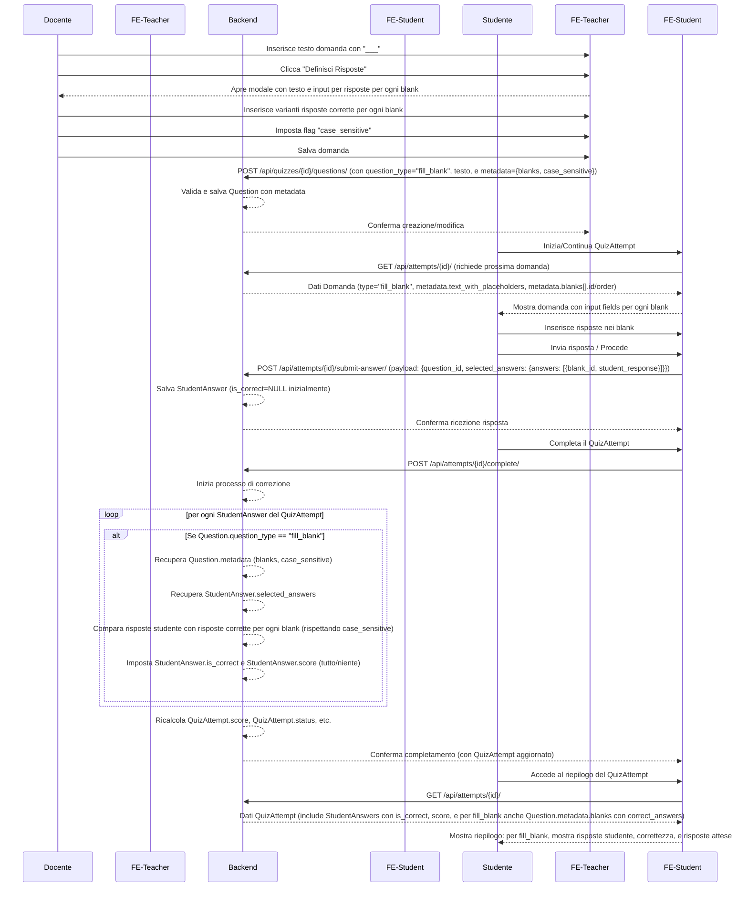

## Piano di Implementazione: Domande "Fill in the Blank"

**Versione:** 1.0
**Data:** 9 Maggio 2025
**Autore:** Roo (Architect AI)
**Riferimento Documento Principale:** [`design_document.md`](design_document.md)
**Discussione Precedente:** Gestione Domande Aperte ([`OPEN_ANSWER_GRADING_PLAN.md`](OPEN_ANSWER_GRADING_PLAN.md))

### 1. Obiettivo

Introdurre il supporto completo per le domande di tipo "Fill in the Blank" (`fill_blank`) all'interno della piattaforma, consentendo ai docenti di crearle con facilità e agli studenti di rispondere, con un sistema di correzione automatica.

### 2. Requisiti Funzionali Chiave (Riepilogo)

*   **Creazione Domanda (Docente):**
    *   Il docente inserisce il testo della domanda, utilizzando una sequenza di tre o più underscore (es. `___`, `____`, ecc.) per indicare uno spazio vuoto.
    *   Un'interfaccia modale (o simile) permette al docente di definire le risposte corrette per ciascuno spazio vuoto identificato.
    *   Per ogni spazio vuoto, il docente può inserire una o più varianti di risposta corretta (es. "blu", "azzurro").
    *   A livello di intera domanda `fill_blank`, il docente può specificare se la valutazione delle risposte debba essere case-sensitive o case-insensitive (un flag booleano).
*   **Svolgimento Quiz (Studente):**
    *   Lo studente visualizza il testo della domanda con campi di input al posto degli underscore.
    *   Lo studente inserisce le proprie risposte nei campi forniti.
*   **Correzione (Automatica):**
    *   La correzione avviene automaticamente al momento del completamento del tentativo di quiz.
    *   La domanda è considerata corretta (e quindi viene assegnato il punteggio previsto per la domanda) **solo se tutte le risposte fornite dallo studente per ogni spazio vuoto corrispondono ad una delle varianti corrette definite dal docente**, rispettando l'impostazione case-sensitive/insensitive della domanda.
    *   Se anche un solo spazio vuoto non è corretto, l'intera domanda `fill_blank` è considerata sbagliata e non assegna punteggio.
*   **Visualizzazione Risultati (Studente):**
    *   Nel riepilogo del quiz, lo studente vede la domanda, le risposte che ha fornito, e un'indicazione se la risposta complessiva alla domanda `fill_blank` è stata corretta o sbagliata.
    *   Sarebbe utile mostrare anche le risposte corrette attese per ogni spazio, specialmente se la risposta dello studente è stata valutata come errata.

### 3. Impatti sui Modelli Dati e API

#### 3.1. Modello Dati `Question` ([`design_document.md:238-245`](design_document.md:238-245))

Il campo `metadata` (JSONB) del modello `Question` sarà utilizzato per memorizzare la configurazione specifica delle domande `fill_blank`. Proposta di struttura per `Question.metadata` quando `question_type` è `fill_blank`:

```json
{
  "text_with_placeholders": "Il cielo è {blank_0} e l'erba è {blank_1}.",
  "blanks": [
    {
      "id": "blank_0",
      "correct_answers": ["blu", "azzurro"],
      "order": 0
    },
    {
      "id": "blank_1",
      "correct_answers": ["verde"],
      "order": 1
    }
  ],
  "case_sensitive": false,
  "points": 1
}
```

*   `text_with_placeholders`: Il testo originale della domanda dove gli underscore sono stati sostituiti da placeholder univoci (es. `{blank_0}`, `{blank_1}`) per facilitare il rendering e l'associazione con le risposte.
*   `blanks`: Un array di oggetti, ognuno rappresentante uno spazio vuoto.
    *   `id`: Un identificatore univoco per lo spazio (potrebbe essere generato automaticamente, es. `blank_0`, `blank_1`, ...).
    *   `correct_answers`: Lista delle stringhe accettate come risposte corrette per quello specifico spazio.
    *   `order`: L'indice posizionale dello spazio vuoto nel testo.
*   `case_sensitive`: Booleano che indica se la comparazione delle risposte deve essere case-sensitive.
*   `points`: Punteggio assegnato se l'intera domanda è corretta.

#### 3.2. Modello Dati `StudentAnswer` ([`design_document.md:319-327`](design_document.md:319-327))

Il campo `selected_answers` (JSONB) del modello `StudentAnswer` memorizzerà le risposte fornite dallo studente. Proposta di struttura per `StudentAnswer.selected_answers` per una domanda `fill_blank`:

```json
{
  "answers": [
    { "blank_id": "blank_0", "student_response": "blu" },
    { "blank_id": "blank_1", "student_response": "verde scuro" }
  ]
}
```

*   `answers`: Un array di oggetti, ognuno contenente:
    *   `blank_id`: L'ID dello spazio vuoto a cui si riferisce la risposta.
    *   `student_response`: La stringa inserita dallo studente.

#### 3.3. Logica di Correzione (Backend)

La logica di correzione automatica dovrà:

1.  Recuperare la configurazione della domanda `fill_blank` da `Question.metadata`.
2.  Recuperare le risposte dello studente da `StudentAnswer.selected_answers`.
3.  Per ogni spazio vuoto definito in `Question.metadata.blanks`:
    *   Trovare la risposta corrispondente dello studente.
    *   Confrontare la `student_response` con l'array `correct_answers` dello spazio vuoto, tenendo conto del flag `case_sensitive` della domanda.
    *   Se la `student_response` non matcha nessuna delle `correct_answers`, la domanda è considerata sbagliata.
4.  Se tutte le risposte degli studenti per ogni spazio vuoto sono corrette, allora `StudentAnswer.is_correct` sarà `True` e `StudentAnswer.score` sarà il punteggio previsto per la domanda. Altrimenti, `is_correct` sarà `False` e `score` sarà `0`.
5.  Questa logica andrà integrata nel processo di calcolo del punteggio del `QuizAttempt` quando viene completato.

#### 3.4. API REST

*   **Endpoint di Creazione/Modifica Domande (Docente):**
    *   `POST /api/quizzes/{quiz_id}/questions/`
    *   `PUT /api/quizzes/{quiz_id}/questions/{question_id}/`
    *   Il payload per questi endpoint, quando `question_type` è `fill_blank`, dovrà accettare una struttura che permetta di definire il testo della domanda e, attraverso la modale o un meccanismo simile, la configurazione degli spazi vuoti (risposte corrette, flag case-sensitive). Il backend dovrà poi processare questo input per popolare correttamente `Question.text` e `Question.metadata`.
*   **Endpoint di Svolgimento Quiz (Studente):**
    *   `GET /api/attempts/{attempt_id}/` (o l'endpoint che restituisce i dettagli della domanda durante lo svolgimento): Dovrà serializzare `Question.metadata.text_with_placeholders` e l'elenco degli `id` e `order` dei blank, ma **non** le `correct_answers`.
    *   `POST /api/attempts/{attempt_id}/submit-answer/`: Il payload per una domanda `fill_blank` dovrà contenere la struttura definita sopra per `StudentAnswer.selected_answers`.
*   **Endpoint Riepilogo Quiz (Studente):**
    *   `GET /api/attempts/{attempt_id}/`: Quando il quiz è completato, il serializer per `StudentAnswer` (per domande `fill_blank`) dovrebbe includere, oltre alla risposta dello studente e a `is_correct`, anche le `Question.metadata.blanks` (con le `correct_answers`) per permettere al frontend di mostrare le risposte attese.

### 4. Interfaccia Utente (Frontend)

#### 4.1. [`frontend-teacher`](frontend-teacher)

*   **Componente Editor Domanda `fill_blank`:**
    *   Un campo di testo per inserire il testo della domanda. Il componente dovrà identificare le sequenze di `___` (o più) underscore.
    *   Un pulsante "Definisci Risposte Spazi Vuoti" (o simile) che, una volta che il testo è stato inserito, apre una modale.
    *   **Modale di Definizione Risposte:**
        *   Visualizza il testo della domanda con i campi di input (o aree cliccabili) al posto degli underscore.
        *   Per ogni spazio vuoto, il docente può inserire una o più stringhe come risposte corrette.
        *   Un checkbox/toggle per impostare il flag `case_sensitive` per l'intera domanda.
    *   Il componente dovrà costruire l'oggetto `metadata` corretto da inviare al backend.
*   **Viste di Creazione/Modifica Quiz:** Integrare il nuovo componente editor.

#### 4.2. [`frontend-student`](frontend-student)

*   **Componente Visualizzazione Domanda `fill_blank` (Svolgimento):**
    *   Renderizza `Question.metadata.text_with_placeholders` sostituendo i placeholder con campi di input HTML.
    *   Raccoglie le risposte dello studente e le struttura correttamente per l'invio all'API.
*   **Componente Visualizzazione Risultato Domanda `fill_blank` (Riepilogo):**
    *   Mostra il testo della domanda.
    *   Mostra le risposte fornite dallo studente per ogni spazio.
    *   Indica chiaramente se la risposta complessiva è corretta o sbagliata.
    *   Se sbagliata (o anche se corretta, per feedback), mostra le risposte corrette attese (`Question.metadata.blanks[i].correct_answers`) per ogni spazio.

### 5. Diagramma di Flusso (Mermaid)



### 6. Prossimi Passi

1.  **Revisione e Approvazione:** Revisione di questo piano. (FATTO)
2.  **Dettaglio Struttura `metadata`:** Confermare la struttura JSON per `Question.metadata` e `StudentAnswer.selected_answers`. (FATTO)
3.  **Sviluppo Backend:**
    *   ~~Aggiornare i modelli.~~ (FATTO - Modificato `QuestionType` in [`apps/education/models.py`](apps/education/models.py:25) per usare `'fill_blank'` (minuscolo) come valore per coerenza documentale e con il frontend, risolvendo un errore di validazione.)
    *   ~~Implementare la logica di correzione automatica per `fill_blank` nel processo di completamento del `QuizAttempt` ([`apps/education/views.py`](apps/education/views.py:1500)).~~ (FATTO)
    *   ~~Aggiornare i serializers (`QuestionSerializer`, `QuizAttemptDetailSerializer` in [`apps/education/serializers.py`](apps/education/serializers.py)) per gestire la serializzazione dinamica dei metadati e passare il contesto corretto.~~ (FATTO)
    *   ~~Implementare la logica di validazione per la struttura dei `Question.metadata` per `fill_blank` in `QuestionSerializer.validate_metadata` ([`apps/education/serializers.py`](apps/education/serializers.py:138)).~~ (FATTO)
4.  **Progettazione UI/UX (Frontend):** (COMPLETATA)
    *   Definire nel dettaglio l'interfaccia per il docente per la creazione delle domande `fill_blank` (in particolare la modale di definizione risposte). (Implementazione iniziale e miglioramento UI per evidenziazione blank attivo FATTI in [`frontend-teacher/src/components/questions/FillBlankQuestionEditor.vue`](frontend-teacher/src/components/questions/FillBlankQuestionEditor.vue:1) - Ulteriori dettagli/revisioni potrebbero essere necessari)
    *   Definire come lo studente interagirà con le domande `fill_blank` durante lo svolgimento. (COMPLETATO - Definito come segue: Lo studente visualizzerà il testo della domanda con campi di input HTML al posto dei placeholder `{blank_N}`. Le risposte inserite verranno raccolte e strutturate per l'invio all'API come descritto in sezione 3.2 e 4.2.1. L'implementazione è in [`frontend-student/src/components/quiz/questions/FillBlankQuestion.vue`](frontend-student/src/components/quiz/questions/FillBlankQuestion.vue:1))
    *   Definire come verranno visualizzati i risultati delle domande `fill_blank` nel riepilogo del quiz. (COMPLETATO - Definito come segue: Nel riepilogo, verrà mostrato il testo della domanda, le risposte fornite dallo studente, l'indicazione di correttezza e, in caso di errore o per feedback, le risposte corrette attese per ogni spazio, come implementato in [`frontend-student/src/components/quiz/questions/FillBlankQuestion.vue`](frontend-student/src/components/quiz/questions/FillBlankQuestion.vue:1) in modalità `result`.)
5.  **Sviluppo Frontend ([`frontend-teacher`](frontend-teacher)):** (FATTO)
    *   ~~Creare il componente editor per le domande `fill_blank`, inclusa la modale per la definizione delle risposte e il flag `case_sensitive`.~~ (FATTO - implementato e ulteriormente raffinato in [`frontend-teacher/src/components/questions/FillBlankQuestionEditor.vue`](frontend-teacher/src/components/questions/FillBlankQuestionEditor.vue:1) per una gestione robusta dei metadati (inclusi controlli su array e l'invio predefinito del campo `points`))
    *   ~~Integrare il componente nelle viste di creazione/modifica quiz, assicurando che i `metadata` corretti vengano inviati al backend.~~ (FATTO - integrato in [`frontend-teacher/src/views/QuestionFormView.vue`](frontend-teacher/src/views/QuestionFormView.vue:1))
6.  **Sviluppo Frontend ([`frontend-student`](frontend-student)):** (FATTO)
    *   ~~Creare il componente per la visualizzazione e l'interazione con le domande `fill_blank` durante lo svolgimento (rendering di `text_with_placeholders` e input fields).~~ (FATTO - implementato in [`frontend-student/src/components/quiz/questions/FillBlankQuestion.vue`](frontend-student/src/components/quiz/questions/FillBlankQuestion.vue:1))
    *   ~~Aggiornare il componente di visualizzazione dei risultati del quiz per mostrare correttamente i dettagli delle risposte `fill_blank` (risposta studente, correttezza, risposte attese).~~ (FATTO - implementato in [`frontend-student/src/components/quiz/questions/FillBlankQuestion.vue`](frontend-student/src/components/quiz/questions/FillBlankQuestion.vue:1) con modalità `result`)
7.  **Test:** (PIANIFICATO)
    *   Scrivere test unitari per la nuova logica di correzione nel backend. (PIANIFICATO - Verranno creati test per coprire vari scenari di risposte corrette/errate, gestione case-sensitive/insensitive, e corretta assegnazione dei punteggi come descritto nella sezione 3.3).
    *   Scrivere test unitari per i metodi `to_representation` e `validate_metadata` nei serializer. (PIANIFICATO - Verranno creati test per assicurare la corretta serializzazione/deserializzazione e validazione dei metadata per le domande fill_blank in [`apps/education/serializers.py`](apps/education/serializers.py)).
    *   Scrivere test di integrazione per gli endpoint API che gestiscono la creazione, l'aggiornamento e lo svolgimento di quiz con domande `fill_blank`. (PIANIFICATO - Verranno testati i flussi API completi descritti nella sezione 3.4, inclusa la creazione della domanda, la sottomissione delle risposte e la visualizzazione dei risultati).
    *   Testare manualmente il flusso end-to-end. (PIANIFICATO - Verrà eseguito un test completo del flusso utente, dalla creazione della domanda da parte del docente, allo svolgimento da parte dello studente, fino alla visualizzazione dei risultati, per assicurare che tutte le componenti interagiscano correttamente).

### 7. Considerazioni Aggiuntive

*   **Complessità del testo:** Considerare come gestire casi limite nel testo inserito dal docente (es. underscore usati per altri scopi). La sostituzione con placeholder normalizzati (`{blank_0}`) nel backend potrebbe aiutare a standardizzare.
*   **Esperienza Utente:** La modale per il docente deve essere molto chiara su quale underscore corrisponde a quale campo di input per la risposta corretta.
*   **Localizzazione:** Se in futuro si prevede la localizzazione, la gestione delle stringhe e delle risposte corrette dovrà tenerne conto.