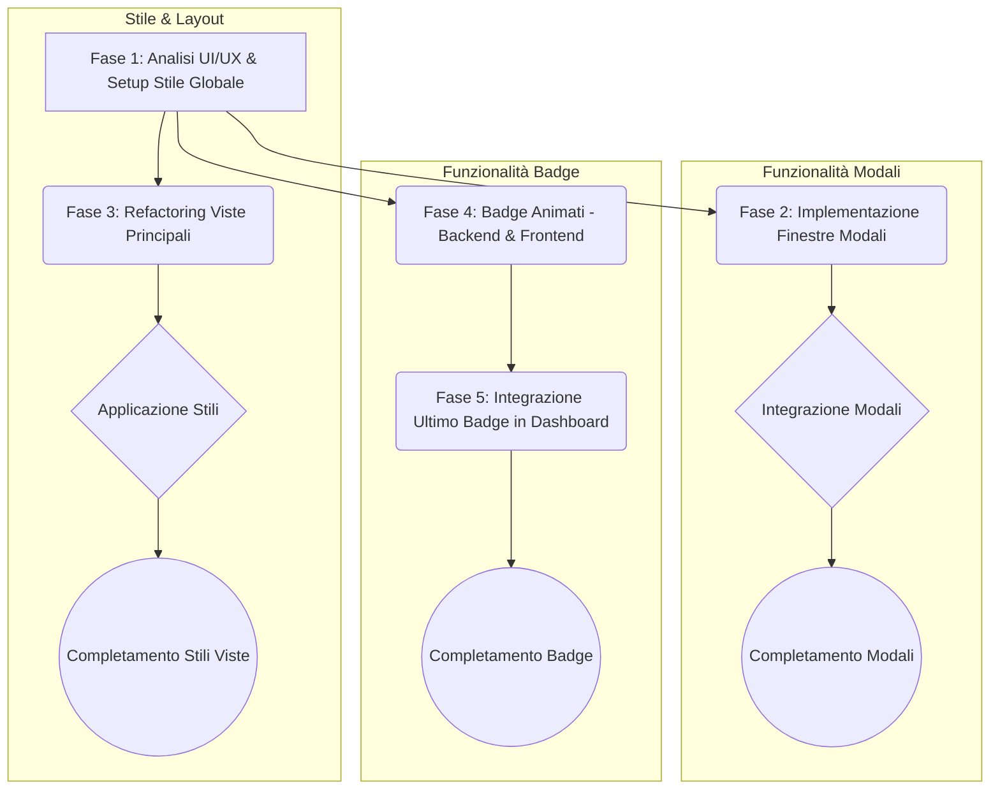

# Piano di Upgrade Grafico Frontend Studenti (Ispirato a Kahoot)

**Data:** 21 Aprile 2025

## Obiettivi Specifici

1.  **Stile Visivo "Kahoot-like":** Implementare colori vivaci, font giocosi, stile dei bottoni specifico e layout degli elementi ispirati a Kahoot.
2.  **Badge Animati (CSS/SVG):** Supportare e visualizzare badge con icone animate definite tramite CSS o SVG.
3.  **Integrazione Ultimo Badge Dashboard:** Mostrare l'ultimo badge guadagnato come "rank" nella dashboard dello studente, filtrando i dati nel frontend.
4.  **Finestre Modali per Quiz:** Presentare la visualizzazione dei dettagli del quiz (`QuizDetailsView`) e lo svolgimento del quiz (`QuizAttemptView`) all'interno di finestre modali.

## Piano di Implementazione

### Fase 1: Analisi UI/UX & Setup Stile Globale

*   **1.1. Analisi Kahoot:** Identificare palette colori, font, stile bottoni, layout elementi, animazioni feedback.
*   **1.2. Aggiornamento Configurazione Stile:** Aggiornare `tailwind.config.js` e stili base (`assets/main.css` o simile).
*   **1.3. Creazione Componenti Base:** Creare `BaseButton.vue`, `BaseCard.vue` (opzionale), `BaseModal.vue`.

### Fase 2: Implementazione Finestre Modali

*   **2.1. Scelta/Implementazione Componente Modale:** Valutare librerie Vue (es. `vue-final-modal`, `headlessui/vue Dialog`) o usare `BaseModal.vue` custom con Teleport.
*   **2.2. Integrazione `QuizDetailsView`:** Modificare routing (`router/index.ts`) o logica di navigazione per aprire in modale. Gestire passaggio dati.
*   **2.3. Integrazione `QuizAttemptView`:** Modificare logica per avviare svolgimento in modale. Gestire stato e chiusura.

### Fase 3: Refactoring Viste Principali

*   **3.1. Applicazione Stili Globali:** Sostituire bottoni con `BaseButton.vue`, applicare font/colori alle viste principali (`LoginView`, `DashboardView`, `ShopView`, `ProfileView`, `PurchasesView`, `BadgesView`).
*   **3.2. Adeguamento Layout:** Riorganizzare elementi per layout "Kahoot-like".
*   **3.3. Implementazione Animazioni Feedback:** Aggiungere animazioni CSS per feedback corretto/sbagliato in `QuizAttemptView` e componenti domande.

### Fase 4: Badge Animati (CSS/SVG)

*   **4.1. Definizione Strategia Backend:**
    *   **Decisione:** Come rappresentare l'animazione nel modello `Badge`? (Opzioni: classe CSS, SVG diretto, file SVG, misto).
    *   **Implementazione:** Modificare `apps/rewards/models.py` (modello `Badge`), creare/applicare migrazioni Django, aggiornare `BadgeSerializer` e Admin. *(Richiede intervento backend)*.
*   **4.2. Creazione Componente Badge Frontend:** Creare `AnimatedBadge.vue` per renderizzare badge e animazione in base alla strategia scelta.
*   **4.3. Aggiornamento Viste Badge:** Usare `AnimatedBadge.vue` in `BadgesView.vue` e nelle notifiche (`stores/notification.ts`, `NotificationContainer.vue`).

### Fase 5: Integrazione Ultimo Badge ("Rank") in Dashboard

*   **5.1. Recupero Dati Badge e Filtraggio Frontend:**
    *   Utilizzare l'API backend esistente che restituisce *tutti* i badge guadagnati (assicurandosi che includa la data di acquisizione).
    *   Implementare logica nel **frontend** (es. in `stores/dashboard.ts` o direttamente in `DashboardView.vue`) per:
        1.  Recuperare la lista completa dei badge guadagnati.
        2.  Ordinare i badge in base alla data di acquisizione (dal più recente al meno recente).
        3.  Selezionare il primo badge della lista ordinata (l'ultimo guadagnato).
*   **5.2. Visualizzazione in Dashboard:**
    *   Modificare `DashboardView.vue` per:
        *   Recuperare il singolo badge filtrato al punto 5.1.
        *   Visualizzare questo badge in una posizione prominente (es. vicino al nome utente o ai punti) utilizzando il componente `AnimatedBadge.vue`.
        *   Aggiungere un'etichetta appropriata (es. "Rank Attuale", "Ultimo Traguardo").

## Considerazioni Aggiuntive

*   **Librerie Animazioni:** Valutare l'uso di librerie CSS (es. Animate.css) o SVG (es. GSAP) per facilitare la creazione delle animazioni.
*   **Performance:** Monitorare l'impatto delle animazioni, specialmente SVG complesse o un gran numero di elementi animati.
*   **Accessibilità:** Garantire contrasto colori adeguato e considerare opzioni per ridurre le animazioni.
*   **Testing:** Aggiornare/creare test unitari e E2E per coprire le nuove funzionalità (modali, rendering badge animati, filtraggio e visualizzazione ultimo badge).