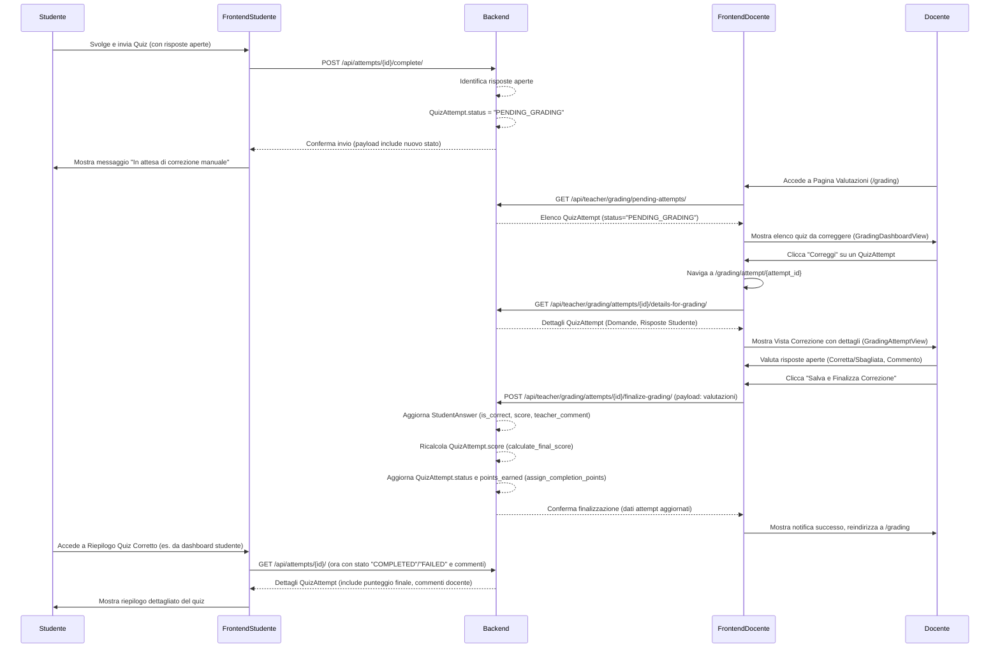

# Piano di Miglioramento: Gestione e Correzione Domande a Risposta Aperta

**Versione:** 1.0
**Data:** 9 Maggio 2025
**Autore:** Roo (Architect AI)
**Riferimento Documento Principale:** [`design_document.md`](design_document.md)

## 1. Obiettivo

Migliorare significativamente l'esperienza utente e l'efficienza del processo di gestione e correzione per i quiz che includono domande a risposta aperta (`open_answer_manual`). Questo piano si concentra sulle modifiche necessarie sia lato studente che lato docente.

## 2. Problemi Attuali Identificati

Dall'analisi e dalla discussione sono emersi i seguenti punti critici:

1.  **Flusso Studente:** Al completamento di un quiz contenente domande `open_answer_manual`, lo studente visualizza un messaggio generico ("non e' possibile determinare lo stato") su sfondo grigio, poco informativo e non in linea con la grafica dell'applicazione.
2.  **Flusso Docente (Pagina di Valutazione Iniziale):**
    *   La notifica di un quiz da valutare arriva, ma nella pagina dedicata (presumibilmente la vista gestita da [`frontend-teacher/src/views/GradingView.vue`](frontend-teacher/src/views/GradingView.vue) o una simile) i campi relativi alla domanda specifica e allo studente che ha svolto il quiz non sono correttamente valorizzati o presentati in modo chiaro.
    *   L'attuale visualizzazione è confusionaria e non permette al docente di identificare facilmente i quiz che richiedono il suo intervento.
3.  **Flusso Docente (Processo di Correzione):** Manca un flusso strutturato e un'interfaccia dedicata per la correzione delle singole risposte aperte.
4.  **Visualizzazione Riepilogo:** La possibilità per lo studente di visualizzare un riepilogo dettagliato del quiz completato, inclusi i feedback per le risposte aperte, necessita di essere implementata o migliorata.

## 3. Soluzione Proposta e Flussi Utente Dettagliati

Si propone un rinnovamento dei flussi per studente e docente, con l'introduzione di nuove interfacce e la modifica di quelle esistenti.

### 3.1. Flusso Studente

1.  **Svolgimento Quiz:** Lo studente svolge il quiz normalmente.
2.  **Completamento Quiz con Risposte Aperte:**
    *   Quando lo studente invia un quiz che contiene almeno una domanda di tipo `open_answer_manual`, il sistema backend imposta lo stato del `QuizAttempt` a `pending_manual_grading` (come da [`design_document.md:316`](design_document.md:316)).
    *   **Interfaccia Studente:** Immediatamente dopo l'invio, il frontend ([`frontend-student`](frontend-student)) visualizza un messaggio chiaro e graficamente coerente (es. sfondo giallo, icona/placeholder di attesa, simile ai messaggi di successo/fallimento). Il messaggio informerà lo studente che il quiz è stato inviato correttamente e che alcune risposte richiedono la valutazione manuale da parte del docente. Esempio testo: "Quiz inviato! Alcune risposte richiedono la correzione del docente. Riceverai una notifica quando il risultato finale sarà disponibile."
3.  **Visualizzazione Post-Correzione:**
    *   Una volta che il docente ha completato la correzione, lo stato del `QuizAttempt` diventa `completed`.
    *   Lo studente potrà accedere al riepilogo dettagliato del quiz (vedi sezione 3.4).

### 3.2. Flusso Docente: Pagina di Valutazione

1.  **Accesso alla Pagina di Valutazione:** Il docente naviga alla sezione dedicata alle valutazioni (es. [`frontend-teacher/src/views/GradingDashboardView.vue`](frontend-teacher/src/views/GradingDashboardView.vue)).
2.  **Elenco Quiz da Correggere:**
    *   La pagina mostra un elenco chiaro e ordinato dei `QuizAttempt` che hanno lo stato `pending_manual_grading` e sono associati a quel docente.
    *   Per ogni `QuizAttempt` nell'elenco, verranno visualizzate le seguenti informazioni:
        *   Nome e Cognome dello Studente (da `Student.first_name`, `Student.last_name` tramite `QuizAttempt.student_id`)
        *   Titolo del Quiz (da `Quiz.title` tramite `QuizAttempt.quiz_id`)
        *   Data di Svolgimento (utilizzando `QuizAttempt.completed_at` ([`design_document.md:312`](design_document.md:312)) come riferimento temporale per l'ordinamento o la visualizzazione, o `started_at` se `completed_at` è la data di finalizzazione correzione)
    *   Ogni riga dell'elenco avrà un pulsante ben visibile "Correggi" (o simile).

### 3.3. Flusso Docente: Modale di Correzione

1.  **Apertura Modale/Vista:** Cliccando sul pulsante "Correggi" relativo a un `QuizAttempt`, si naviga a una vista dedicata (es. [`frontend-teacher/src/views/GradingAttemptView.vue`](frontend-teacher/src/views/GradingAttemptView.vue)).
2.  **Contenuto della Vista di Correzione:**
    *   **Intestazione:** Informazioni riepilogative del quiz (Titolo, Studente).
    *   **Elenco Domande e Risposte:** La vista presenta tutte le domande del `QuizAttempt`.
        *   **Per le domande `open_answer_manual`:**
            *   Testo della Domanda (`Question.text`).
            *   Risposta fornita dallo Studente (da `StudentAnswer.selected_answers.text`).
            *   Controlli per la valutazione:
                *   Opzione per marcare la risposta come "Corretta" o "Sbagliata" (es. radio buttons, toggle switch).
                *   Un campo di testo per inserire un **Commento del Docente** (facoltativo).
        *   **Per le altre tipologie di domande (già auto-corrette):**
            *   Testo della Domanda.
            *   Risposta fornita dallo Studente.
            *   Indicazione se la risposta automatica è risultata corretta o sbagliata (per contesto).
            *   Eventuali opzioni corrette (se applicabile, es. scelta multipla).
3.  **Azioni nella Vista di Correzione:**
    *   Un pulsante "Salva e Finalizza Correzione" (o simile).
4.  **Finalizzazione della Correzione:**
    *   Cliccando "Salva e Finalizza Correzione":
        *   Il frontend invia al backend le valutazioni (`is_correct`) e i commenti per ogni `StudentAnswer` relativa a domande `open_answer_manual`.
        *   **Logica Backend:**
            *   Per ogni `StudentAnswer` di tipo `open_answer_manual` corretta:
                *   Aggiorna `StudentAnswer.is_correct` (True/False).
                *   Aggiorna `StudentAnswer.score` a `1` se corretta, `0` se sbagliata.
                *   Salva il `teacher_comment`.
            *   Ricalcola il punteggio totale del `QuizAttempt` (`QuizAttempt.score`) sommando i punteggi di tutte le `StudentAnswer`.
            *   Aggiorna `QuizAttempt.points_earned` (se applicabile).
            *   Aggiorna `QuizAttempt.status` a `completed` o `failed` in base alla soglia.
            *   Popola `QuizAttempt.completed_at` con il timestamp della finalizzazione della correzione (se non si vuole sovrascrivere quello della sottomissione studente, considerare un campo `graded_at`).
            *   Salva tutte le modifiche nel database.
    *   La vista reindirizza all'elenco dei quiz da correggere, che si aggiorna.

### 3.4. Visualizzazione Riepilogo Quiz (Estensione a Tutti i Quiz)

1.  **Accesso al Riepilogo:** Lo studente (e potenzialmente anche il docente) deve poter visualizzare un riepilogo dettagliato di qualsiasi `QuizAttempt` completato.
2.  **Contenuto del Riepilogo:**
    *   Informazioni generali: Titolo Quiz, Studente, Data Completamento, Punteggio Finale, Punti Guadagnati.
    *   Elenco di tutte le domande del quiz:
        *   Testo della Domanda.
        *   Risposta data dallo Studente.
        *   Indicazione se la risposta era corretta o sbagliata.
        *   Risposta/e corretta/e (se applicabile, per confronto).
        *   **Per le `open_answer_manual`:** Commento fornito dal Docente.

## 4. Impatti sui Modelli Dati e API

### 4.1. Modelli Dati (Django - `apps.education.models`)

*   **`StudentAnswer` ([`design_document.md:319-327`](design_document.md:319-327)):**
    *   `is_correct` (`BooleanField(null=True)`): Confermata la gestione come `True`/`False` dopo la correzione manuale.
    *   `score` (`FloatField(null=True)`): Per `open_answer_manual`, sarà `1.0` se `is_correct=True`, `0.0` se `is_correct=False`.
    *   **Campo `teacher_comment` (`TextField(null=True, blank=True)`)**: Per memorizzare il feedback testuale del docente. (IMPLEMENTATO)

*   **`QuizAttempt` ([`design_document.md:307-317`](design_document.md:307-317)):**
    *   `status`: Stati confermati: `PENDING` (da iniziare), `PENDING_GRADING` (in attesa di correzione manuale, **deve essere serializzato come `'PENDING_GRADING'` e non `'PENDING'`**), `COMPLETED` (`'COMPLETED'`), `FAILED` (`'FAILED'`). (VERIFICARE SERIALIZZAZIONE BACKEND PER `PENDING_GRADING`)
    *   `score`: Aggiornato dopo la correzione manuale. (LOGICA DI CALCOLO AGGIORNATA)
    *   `completed_at`: Popolato al momento della sottomissione dello studente; non modificato dalla correzione del docente.

### 4.2. API REST (Django REST Framework - `apps.education.views`)

*   **Lato Studente (Esistenti, con possibili adeguamenti logica backend):**
    *   `POST /api/attempts/{attempt_id}/complete/` ([`design_document.md:499`](design_document.md:499)): Il backend imposta `QuizAttempt.status = 'PENDING_GRADING'` se il quiz contiene domande `open_answer_manual`. (LOGICA ESISTENTE CONFERMATA)
    *   `GET /api/attempts/{attempt_id}/` ([`design_document.md:497`](design_document.md:497)): Dovrà serializzare anche `teacher_comment` per le `StudentAnswer` quando il quiz è completato e corretto. (DA VERIFICARE/IMPLEMENTARE NEL SERIALIZER `QuizAttemptDetailSerializer`)

*   **Lato Docente (Nuovi Endpoint nel `TeacherGradingViewSet`):** (IMPLEMENTATI)
    *   **`GET /api/teacher/grading/pending-attempts/`:**
        *   Restituisce un elenco paginato di `QuizAttempt` con `status='PENDING_GRADING'` per il docente autenticato.
        *   Payload Risposta: Array di oggetti, ognuno con `id`, `student_name`, `quiz_title`, `completed_at` (sottomissione studente).
    *   **`GET /api/teacher/grading/attempts/{attempt_id}/details-for-grading/`:**
        *   Restituisce i dettagli completi di un `QuizAttempt` per la correzione.
    *   **`POST /api/teacher/grading/attempts/{attempt_id}/finalize-grading/`:**
        *   Permette al docente di inviare le valutazioni per le risposte aperte e finalizzare la correzione.
        *   Payload Richiesta: `{ "answers": [{"student_answer_id": X, "is_correct": true/false, "teacher_comment": "..."}] }`.
        *   Logica Backend: Aggiorna `StudentAnswer` (is_correct, score, teacher_comment), ricalcola `QuizAttempt.score`, aggiorna `QuizAttempt.status` (tramite `assign_completion_points`).

## 5. Interfaccia Utente (Frontend)

Modifiche significative saranno necessarie nei frontend:

*   **[`frontend-student`](frontend-student):**
    *   Implementare il nuovo messaggio post-completamento quiz con risposte aperte. (FATTO)
    *   Sviluppare/Migliorare la vista di riepilogo del quiz completato, mostrando i commenti del docente. (FATTO per `open_answer_manual`, migliorabile per altri tipi)
*   **[`frontend-teacher`](frontend-teacher):**
    *   Sviluppare la nuova pagina/sezione di "Valutazione" (`GradingDashboardView.vue`) con l'elenco dei quiz da correggere. (IMPLEMENTATA STRUTTURA BASE)
    *   Implementare la vista di correzione del singolo tentativo (`GradingAttemptView.vue`). (IMPLEMENTATA STRUTTURA BASE)
    *   Integrare con i nuovi endpoint API. (PARZIALMENTE FATTO NELLE VISTE BASE)

## 6. Diagramma di Flusso (Mermaid)

## 7. Prossimi Passi

1.  ~~Revisione e approvazione di questo piano.~~ (APPROVATO INIZIALMENTE)
2.  Discussione e pianificazione per la gestione delle domande `fill_blank` (se si vuole affrontare contestualmente o successivamente).
3.  ~~Passaggio alla modalità "code" per l'implementazione delle modifiche descritte in questo piano per le `open_answer_manual`.~~ (COMPLETATO)
    *   ~~Modifiche al backend (modelli, API, logica di calcolo punteggio).~~ (COMPLETATO)
    *   Implementazione delle modifiche al frontend `frontend-teacher`. (COMPLETATO)
    *   Implementazione delle modifiche al frontend `frontend-student`. (COMPLETATO)

## 8. Considerazioni Aggiuntive

*   **Notifiche:** Implementazione di un sistema di notifiche in-app per avvisare lo studente quando un quiz è stato corretto.
    *   **Stato Attuale (In Corso):**
        *   **Backend (`apps.education`):**
            *   Modello `Notification` definito in [`models.py`](apps/education/models.py:1208). (FATTO)
            *   Migrazioni create e applicate. (FATTO)
            *   Logica per creare `Notification` in `TeacherGradingViewSet.finalize_grading` (in [`views.py`](apps/education/views.py:2233)). (FATTO)
            *   `NotificationViewSet` per API (list, mark as read, mark all as read) definito in [`views.py`](apps/education/views.py:62). (FATTO)
            *   `NotificationSerializer` definito in [`serializers.py`](apps/education/serializers.py:1328). (FATTO)
            *   URL per `NotificationViewSet` registrati in [`urls.py`](apps/education/urls.py:27). (FATTO)
        *   **Frontend (`frontend-student`):**
            *   Tipi TypeScript per notifiche definiti in [`src/types/notifications.ts`](frontend-student/src/types/notifications.ts). (FATTO)
            *   Funzioni API per notifiche definite in [`src/api/notifications.ts`](frontend-student/src/api/notifications.ts). (FATTO)
            *   Store Pinia (`stores/notification.ts`) aggiornato per gestire stato, getters e actions per le notifiche dal server. (FATTO)
            *   Corretto errore TypeScript in [`src/views/QuizAttemptView.vue`](frontend-student/src/views/QuizAttemptView.vue:258) relativo a `addBadgeToastNotification`. (FATTO)
    *   **Passi Rimanenti:**
        *   **Frontend (`frontend-student`):**
            *   Implementare UI per la campanella e il dropdown delle notifiche in [`src/App.vue`](frontend-student/src/App.vue:0) (header). (FATTO)
                *   Visualizzare conteggio notifiche non lette. (FATTO)
                *   Mostrare notifiche nel dropdown. (FATTO)
                *   Gestire azioni: segna come letta, segna tutte come lette, navigazione al link. (FATTO)
            *   Chiamare `fetchServerNotifications` in `onMounted` di [`src/App.vue`](frontend-student/src/App.vue:0). (FATTO)
        *   **Test (Backend & Frontend):**
            *   Test unitari per la logica di creazione notifiche e API backend.
            *   Test manuali completi del flusso di notifiche nel frontend.
*   **Test:** Sarà fondamentale scrivere test unitari e di integrazione per coprire i nuovi flussi e la logica di backend e frontend.

## 9. Stato Implementazione (al 9 Maggio 2025)

### 9.1. Backend (`apps.education`)

*   **Modelli:**
    *   `StudentAnswer`: Aggiunto campo `teacher_comment: TextField`. (FATTO)
    *   `QuizAttempt`: Stato `PENDING_GRADING` confermato. Logica di `calculate_final_score` aggiornata per includere punteggi manuali (0/1 per risposte aperte). (FATTO)
*   **Migrazioni:** Create e applicate. (FATTO)
*   **Serializers (`serializers.py`):**
    *   `PendingQuizAttemptSerializer`: Creato. (FATTO)
    *   `GradingStudentAnswerSerializer`: Creato. (FATTO)
    *   `GradingQuestionWithAnswerSerializer`: Creato. (FATTO)
    *   `GradingQuizAttemptDetailSerializer`: Creato. (FATTO)
    *   `GradeSubmissionItemSerializer`: Creato. (FATTO)
    *   `GradeSubmissionSerializer`: Creato. (FATTO)
*   **Views (`views.py`):**
    *   `AttemptViewSet.complete_attempt`: Logica per impostare `PENDING_GRADING` verificata e confermata. (FATTO)
    *   `TeacherGradingViewSet`: Creato con azioni: (FATTO)
        *   `list_pending_attempts` (`GET /teacher/grading/pending-attempts/`)
        *   `get_attempt_details_for_grading` (`GET /teacher/grading/attempts/{pk}/details-for-grading/`)
        *   `finalize_grading` (`POST /teacher/grading/attempts/{pk}/finalize-grading/`)
*   **URLs (`urls.py`):**
    *   `TeacherGradingViewSet` registrato correttamente. (FATTO)

### 9.2. Frontend Docente (`frontend-teacher`)

*   **Tipi (`src/types/education.ts`):**
    *   Definizioni base per `QuizAttempt`, `Question`, `AnswerOption`. (FATTO)
*   **Viste (`src/views/`):**
    *   `GradingDashboardView.vue`: Implementazione completata, inclusa integrazione API e logica per elencare tentativi. (COMPLETATO)
    *   `GradingAttemptView.vue`: Implementazione completata, inclusa integrazione API e logica per la correzione del singolo tentativo. (COMPLETATO)
*   **Router (`src/router/index.ts`):**
    *   Rotta `/grading` aggiornata per `GradingDashboardView.vue`. (FATTO)
    *   Nuova rotta `/grading/attempt/:attemptId` per `GradingAttemptView.vue`. (FATTO)

### 9.3. Frontend Studente (`frontend-student`) - COMPLETATO

*   **Vista Svolgimento Quiz (es. [`QuizAttemptView.vue`](frontend-student/src/views/QuizAttemptView.vue)):**
    *   Modificata la logica post-completamento per visualizzare il messaggio "In attesa di correzione manuale" se `QuizAttempt.status` è `PENDING_GRADING`. (FATTO)
*   **Vista Riepilogo Tentativo (es. [`QuizResultView.vue`](frontend-student/src/views/QuizResultView.vue)):**
    *   Assicurato che il `teacher_comment` da `StudentAnswer` sia visualizzato per le domande a risposta aperta (tramite modifiche a [`OpenAnswerManualQuestion.vue`](frontend-student/src/components/quiz/questions/OpenAnswerManualQuestion.vue) e sua integrazione). (FATTO)
    *   Assicurato che il punteggio finale e lo stato riflettano la correzione manuale. (FATTO)
    *   **Estesa la visualizzazione dettagliata nel riepilogo a tutti i tipi di domanda (MC_SINGLE, MC_MULTI, TF, FILL_BLANK) utilizzando componenti specifici in modalità "risultato". (FATTO)**

### 9.4. Documento di Design (`design_document.md`)

*   Verificare e aggiornare i riferimenti da `frontend-student-v2` a `frontend-student` se presenti. (DA FARE)