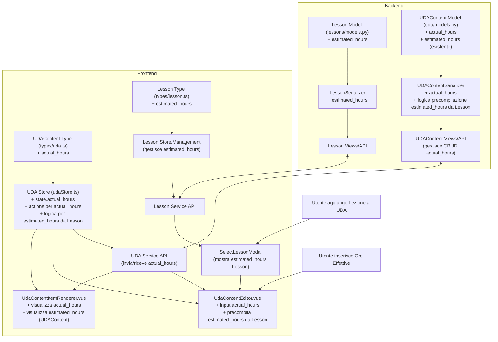

# Piano di Implementazione: Aggiornamenti UDA e ContentItem

**Versione:** 1.0
**Data:** 17 Maggio 2025
**Autore:** Roo (Architect Mode)
**Riferimento Richiesta:** Conversazione del 17 Maggio 2025

## 1. Introduzione

Questo documento descrive il piano di implementazione per le seguenti modifiche e correzioni relative alla gestione delle Unità Didattiche di Apprendimento (UDA) e dei loro contenuti (`ContentItem`):

1.  **Correzione Visualizzazione Titoli:** Risolvere il problema per cui i titoli dei `ContentItem` vengono mostrati come placeholder generici (es. "Titolo Lezione") in modalità modifica (`isEdit = true`) all'interno del componente `UdaContentItemRenderer.vue`.
2.  **Ore Stimate per Lezioni:** Estendere la funzionalità delle ore stimate (`estimated_hours`) per applicarle direttamente alle Lezioni (`Lesson`) e precompilare questo valore quando una lezione viene aggiunta come contenuto a un'UDA.
3.  **Ore Effettive per `UDAContent`:** Introdurre un nuovo campo per tracciare le ore effettive (`actual_hours`) spese per ciascun `UDAContent`.

## 2. Analisi Preliminare e Obiettivi

### 2.1. Correzione Visualizzazione Titoli

*   **Problema:** In `UdaContentItemRenderer.vue`, quando la prop `isEdit` è `true`, il titolo effettivo del contenuto (lezione, quiz, nota, attività) non viene visualizzato, sostituito da un placeholder generico.
*   **Obiettivo:** Identificare la causa della mancata visualizzazione del titolo in modalità modifica e correggerla per mostrare sempre il titolo corretto del `ContentItem`.

### 2.2. Ore Stimate per Lezioni

*   **Necessità:** Attualmente le `estimated_hours` sono definite solo a livello di `UDAContent`. Si vuole che anche il modello `Lesson` abbia un suo campo `estimated_hours`.
*   **Obiettivo:**
    *   Modificare il backend per aggiungere `estimated_hours` al modello `Lesson`.
    *   Quando una `Lesson` esistente viene aggiunta a un `UDAContent`, le `estimated_hours` del `UDAContent` devono essere precompilate con il valore proveniente dalla `Lesson` (rimanendo sovrascrivibili a livello di `UDAContent`).
    *   Aggiornare il frontend per supportare la gestione e visualizzazione di `estimated_hours` per le `Lesson`.

### 2.3. Ore Effettive per `UDAContent`

*   **Necessità:** Tracciare il tempo effettivamente speso per completare un `UDAContent`.
*   **Obiettivo:**
    *   Aggiungere un campo `actual_hours` al modello `UDAContent` nel backend.
    *   Aggiornare il frontend (store, servizi, componenti UI) per permettere l'inserimento e la visualizzazione delle `actual_hours` per ciascun `UDAContent`.

## 3. Piano di Implementazione Dettagliato

### 3.1. Correzione Visualizzazione Titoli in `UdaContentItemRenderer.vue`

*   **Fase 1: Analisi (Sviluppatore Frontend)** [COMPLETATO]
    1.  Ispezionare il componente `UdaContentItemRenderer.vue` e i componenti genitori (probabilmente `UdaDetailView.vue` o simili che gestiscono lo stato `isEdit`). [COMPLETATO - Analizzato `UdaContentItemRenderer.vue`, `UdaDetailView.vue`, `UdaFormView.vue`, `UdaContentEditor.vue`]
    2.  Verificare come i dati del `ContentItem` (incluso il titolo) vengono passati e acceduti quando `isEdit` è `true`. [COMPLETATO - Identificato che `UdaFormView.vue` tramite `UdaContentEditor.vue` passa dati non arricchiti]
    3.  Identificare se il problema risiede nel recupero dati, nel passaggio delle props, o nella logica condizionale del template. [COMPLETATO - Problema nel mancato arricchimento dei dati in `UdaContentEditor.vue`]
    *   **Strumenti:** Vue Devtools, console del browser.
*   **Fase 2: Implementazione (Sviluppatore Frontend)** [COMPLETATO]
    1.  Modificare `UdaContentEditor.vue` per arricchire i `content` items con `lesson_title` e `quiz_title` prima di passarli a `UdaContentItemRenderer.vue`. [COMPLETATO]
    2.  Non sono state necessarie modifiche dirette a `UdaContentItemRenderer.vue` per la logica del titolo, ma il problema è stato risolto a monte.

### 3.2. Ore Stimate (`estimated_hours`) per Lezioni

*   **Fase 1: Backend (Sviluppatore Backend)** [COMPLETATO]
    1.  **Modello `Lesson`:** [COMPLETATO]
        *   Aprire il file `lessons/models.py`.
        *   Aggiungere il seguente campo al modello `Lesson`:
            ```python
            estimated_hours = models.DecimalField(max_digits=4, decimal_places=1, null=True, blank=True, verbose_name="Ore Stimate Lezione")
            ```
    2.  **Migrazioni:** [COMPLETATO]
        *   Eseguire `python manage.py makemigrations lezioni`.
        *   Eseguire `python manage.py migrate lezioni`.
    3.  **Serializer `LessonSerializer`:** [COMPLETATO]
        *   Aprire il file `lezioni/serializers.py`.
        *   Aggiungere `estimated_hours` ai `fields` di `LessonSerializer` e `LessonWriteSerializer`.
    4.  **Serializer `UDAContentSerializer`:** [COMPLETATO]
        *   Aprire il file `apps/uda/serializers.py`.
        *   Modificare i metodi `create` e `update` per precompilare `UDAContent.estimated_hours` con `Lesson.estimated_hours` se il `content_type` è `LESSON` e una `lesson` è fornita e ha `estimated_hours` impostate (e non sovrascritto esplicitamente).

*   **Fase 2: Frontend (Sviluppatore Frontend)** [COMPLETATO]
    1.  **Tipi TypeScript:** [COMPLETATO]
        *   Aggiornare l'interfaccia `Lesson` in `frontend-lessons/src/types/lezioni.ts` per includere `estimated_hours?: number;`.
    2.  **Store (Pinia - `lessonStore.ts`):** [COMPLETATO]
        *   Aggiornare le azioni `addLesson` e `updateLesson` in `frontend-lessons/src/stores/lessons.ts` per accettare `estimated_hours`. Le azioni di fetch dovrebbero già recuperarlo.
    3.  **Servizi API (`lessonService.ts` o `apiClient.ts`):** [VERIFICATO - NESSUNA MODIFICA NECESSARIA]
        *   Le chiamate API esistenti passano l'intero oggetto dati, quindi `estimated_hours` viene incluso automaticamente.
    4.  **Componenti UI:** [COMPLETATO]
        *   **Selezione Lezione (`SelectExistingContentModal.vue`):** [COMPLETATO] Aggiornato per visualizzare `lesson.estimated_hours` e includerlo nell'oggetto emesso.
        *   **Editor Contenuto UDA (`UdaContentEditor.vue`):** [VERIFICATO - GESTITO] La logica in `handleExistingContentSelected` utilizza già `estimated_hours` dall'oggetto ricevuto dalla modale.
        *   **Visualizzazione Contenuto Lezione (`UdaContentLessonDisplay.vue`):** [VERIFICATO - GIÀ PRESENTE] Mostra già `props.content.estimated_hours`.
        *   **Visualizzazione Contenuto Quiz (`QuizContentDisplay.vue`):** [VERIFICATO - GIÀ PRESENTE] Mostra già `props.content.estimated_hours`.
        *   **Visualizzazione Contenuto Nota (`NoteContentDisplay.vue`):** [VERIFICATO - GIÀ PRESENTE] Mostra già `props.content.estimated_hours`.
        *   **Visualizzazione Contenuto Attività (`ActivityContentDisplay.vue`):** [VERIFICATO - GIÀ PRESENTE] Mostra già `props.content.estimated_hours`.

### 3.3. Ore Effettive (`actual_hours`) per `UDAContent`

*   **Fase 1: Backend (Sviluppatore Backend)** [COMPLETATO]
    1.  **Modello `UDAContent`:** [COMPLETATO]
        *   Aprire il file `apps/uda/models.py`.
        *   Aggiungere il campo `actual_hours` al modello `UDAContent`.
    2.  **Migrazioni:** [COMPLETATO]
        *   Eseguire `python manage.py makemigrations uda`.
        *   Eseguire `python manage.py migrate uda`.
    3.  **Serializer `UDAContentSerializer`:** [COMPLETATO]
        *   Aprire il file `apps/uda/serializers.py`.
        *   Aggiungere `actual_hours` ai `fields` del serializer.
    4.  **View API (`UDAViewSet` o endpoint per `UDAContent`):** [VERIFICATO - NESSUNA MODIFICA NECESSARIA]
        *   Le view standard dovrebbero gestire il nuovo campo tramite il serializer aggiornato.

*   **Fase 2: Frontend (Sviluppatore Frontend)** [COMPLETATO]
    1.  **Tipi TypeScript:** [COMPLETATO]
        *   Aggiornare l'interfaccia `BaseContent` (e quindi `UDAContent`) in `frontend-lessons/src/types/uda.ts` per includere `actual_hours?: number | null;`.
    2.  **Store (Pinia - `udaStore.ts`):** [VERIFICATO - NESSUNA MODIFICA NECESSARIA]
        *   Lo state e le azioni (`updateContentInUda`, `fetchUda`) dovrebbero gestire `actual_hours` grazie all'aggiornamento dei tipi e alla genericità del passaggio dati.
    3.  **Servizi API (`services/udaService.ts`):** [VERIFICATO - NESSUNA MODIFICA NECESSARIA]
        *   La funzione `updateUdaContent` dovrebbe passare `actual_hours` se presente nei dati.
    4.  **Componenti UI:** [PARZIALMENTE COMPLETATO - Modifica in linea `actual_hours` in corso]
        *   **Editor Contenuto UDA (`UdaContentEditor.vue` tramite modali):**
            *   [`EditNoteContentModal.vue`](frontend-lessons/src/components/uda/EditNoteContentModal.vue:1): [COMPLETATO] Aggiunto input per `actual_hours`.
            *   [`EditActivityContentModal.vue`](frontend-lessons/src/components/uda/EditActivityContentModal.vue:1): [COMPLETATO] Aggiunto input per `actual_hours`.
        *   **Visualizzazione e Modifica In Linea Contenuto (componenti specifici in `UdaDetailView` anche con `isEdit = false`):**
            *   [`LessonContentDisplay.vue`](frontend-lessons/src/components/uda/content-display/LessonContentDisplay.vue:1): [COMPLETATO] Visualizzazione e modifica in linea di `actual_hours` (salvate su `UDAContent`).
            *   [`QuizContentDisplay.vue`](frontend-lessons/src/components/uda/content-display/QuizContentDisplay.vue:1): [COMPLETATO] Visualizzazione di `actual_hours`. (Nota: modifica in linea delle `actual_hours` potrebbe essere estesa per coerenza se necessario).
            *   [`NoteContentDisplay.vue`](frontend-lessons/src/components/uda/content-display/NoteContentDisplay.vue:1): [COMPLETATO] Visualizzazione e modifica in linea di `actual_hours`.
            *   [`ActivityContentDisplay.vue`](frontend-lessons/src/components/uda/content-display/ActivityContentDisplay.vue:1): [COMPLETATO] Visualizzazione e modifica in linea di `actual_hours`.
        *   **Logica di Salvataggio:** Le `actual_hours` modificate in linea saranno salvate sull'istanza di `UDAContent` associata, non sull'entità `Lesson` originale (nel caso di contenuto di tipo Lezione).

## 4. Diagramma di Flusso (Mermaid) - Ore Stimate e Ore Effettive



## 5. Testing

*   **Backend:**
    *   Test unitari per i modelli `Lesson` e `UDAContent` per verificare la corretta gestione dei nuovi campi.
    *   Test unitari per i serializer `LessonSerializer` e `UDAContentSerializer` (validazione, creazione/aggiornamento, logica di precompilazione).
    *   Test di integrazione per gli endpoint API che gestiscono `Lesson` e `UDAContent` per assicurare che `estimated_hours` (per Lesson) e `actual_hours` (per UDAContent) siano salvati e recuperati correttamente.
*   **Frontend:**
    *   Test unitari per gli store Pinia (`udaStore.ts`, e gestione lezioni) per verificare la corretta gestione dello state e delle actions relative a `estimated_hours` e `actual_hours`.
    *   Test unitari per i componenti UI modificati (`UdaContentItemRenderer.vue`, `UdaContentEditor.vue`, etc.) per verificare la corretta visualizzazione e interazione con i nuovi campi e la correzione dei titoli.
    *   Test E2E per i flussi utente:
        *   Corretta visualizzazione dei titoli dei `ContentItem` in modalità visualizzazione e modifica.
        *   Creazione/Modifica di una Lezione con `estimated_hours`.
        *   Aggiunta di una Lezione a un `UDAContent` e verifica della precompilazione e sovrascrittura di `estimated_hours`.
        *   Inserimento e visualizzazione di `actual_hours` per un `UDAContent` tramite modali.
        *   Modifica in linea e visualizzazione di `actual_hours` per Lezioni, Note e Attività direttamente in `UdaDetailView` (modalità visualizzazione) e verifica corretto salvataggio su `UDAContent`.

## 6. Prossimi Passi

1.  **Approvazione del Piano:** Revisione e approvazione di questo piano.
2.  **Analisi Frontend Titoli:** Lo sviluppatore frontend analizza il problema dei titoli in `UdaContentItemRenderer.vue`.
3.  **Sviluppo Backend:** Implementazione delle modifiche ai modelli, serializer e view Django.
4.  **Sviluppo Frontend:** Implementazione delle modifiche agli store, servizi e componenti Vue.js.
5.  **Testing:** Esecuzione dei test unitari e E2E.
6.  **Revisione e Deploy.**