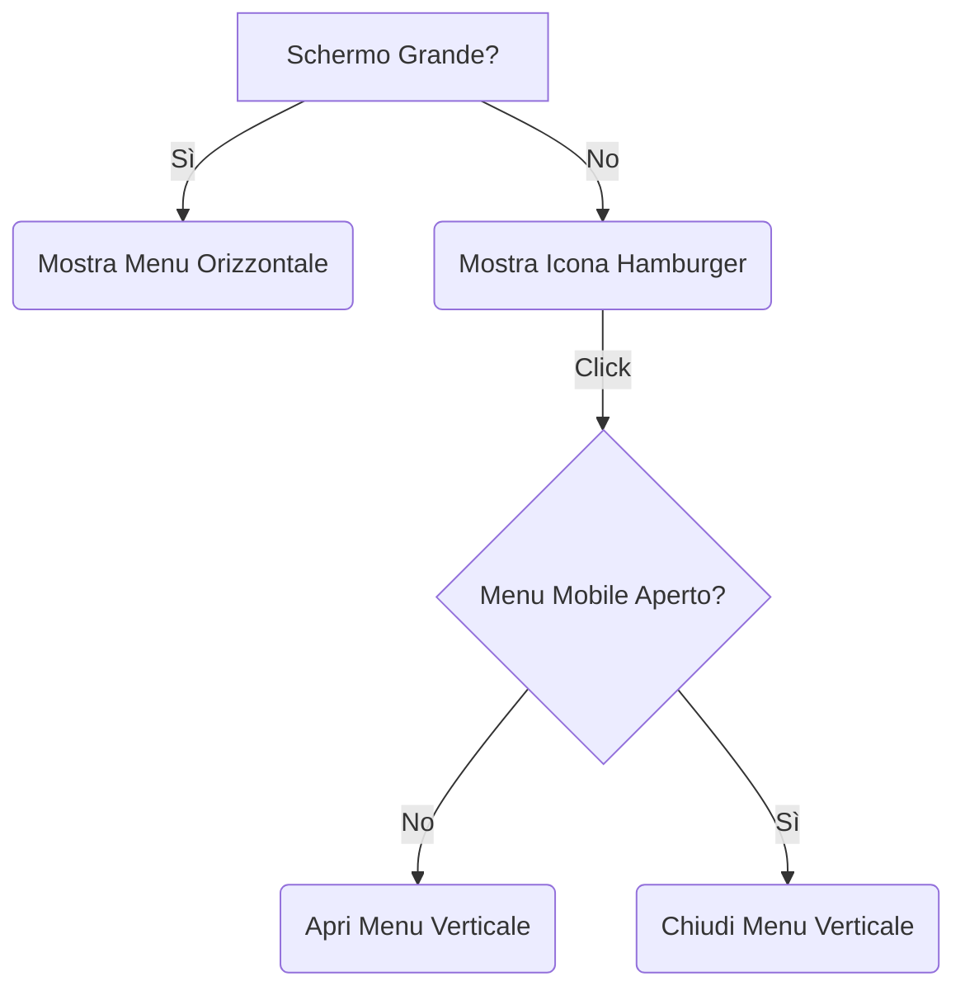
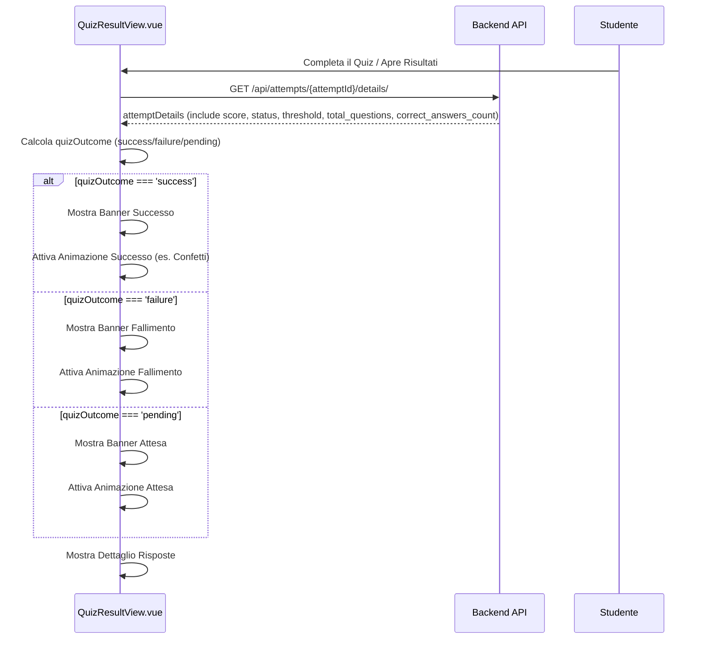

# Piano di Miglioramento Esperienza Utente (UX) - App Educativa

**Versione:** 1.3 (8 Aprile 2025) - Stili Bottoni e Badge Base

## 1. Introduzione

Questo documento delinea un piano per migliorare l'esperienza utente (UX) e correggere bug nell'applicazione educativa, basandosi sui problemi segnalati e sull'analisi del codice esistente. L'obiettivo è rendere l'interfaccia più intuitiva, reattiva, coinvolgente e corretta per docenti e studenti, mantenendo lo stile "Kahoot-like".

## 2. Bug e Problemi UX Identificati

1.  **[BUG] Storico Acquisti Studente Incompleto:** La vista dello storico acquisti (`frontend-student/src/views/PurchasesView.vue`) non mostra il nome e la descrizione della ricompensa acquistata, né le eventuali note di consegna inserite dal docente.
2.  **Menu Docente Non Visibile su Mobile:** Il menu di navigazione principale nel frontend docente (`frontend-teacher`) contiene troppi elementi per essere visualizzato correttamente su schermi di piccole dimensioni (mobile), diventando parzialmente o totalmente illeggibile/inutilizzabile.
3.  **Feedback Insufficiente Risultati Quiz Studente:** La schermata dei risultati del quiz nel frontend studente (`frontend-student`) non comunica in modo chiaro e immediato l'esito (superato/fallito), non mostra il numero di risposte corrette sul totale e manca di elementi visivi coinvolgenti e animazioni specifiche per l'esito.
4.  **Miglioramenti Generali Desiderati:** Necessità di raffinare l'aspetto di elementi comuni come i bottoni e migliorare la coerenza grafica generale per un'esperienza più curata.
5.  **Feedback Caricamento API Poco Visibile:** In alcune situazioni, specialmente con connessioni lente o operazioni API complesse, l'utente potrebbe non avere un feedback chiaro che l'applicazione sta lavorando in background, portando a incertezza o click ripetuti.
6.  **Editing Domande Template Macchinoso:** Il processo di modifica di più domande all'interno di un template quiz richiede di tornare continuamente alla lista, rendendo l'operazione lenta e ripetitiva. Manca un meccanismo di salvataggio automatico e navigazione sequenziale.
7.  **Gamification Limitata:** Il sistema attuale si basa principalmente sui punti e sulle ricompense acquistabili. Mancano elementi di gamification più dinamici e visivi come badge (con animazioni), classifiche o personalizzazione.
8.  **Interfaccia Svolgimento Quiz Monotona:** L'interfaccia in cui lo studente svolge il quiz manca di elementi visivi dinamici (come sfondi o animazioni iniziali) che potrebbero renderla più coinvolgente.
9.  **[BUG] Errori Rendering Frontend Studente:** Errori `InvalidCharacterError` e `TypeError: Cannot read properties of null (reading 'parentNode')` nella console, probabilmente legati a commenti HTML mal posizionati o problemi con transizioni/HMR.

## 3. Analisi Tecnica

*(Le analisi tecniche rimangono invariate rispetto alla versione 1.1)*

### 3.1. [BUG] Storico Acquisti (`frontend-student/src/views/PurchasesView.vue` e Backend)
*   **Causa Probabile:** API non invia `reward` nidificato e `delivery_notes`. Frontend non mostra `delivery_notes`.

### 3.2. Menu Docente (`frontend-teacher/src/App.vue`)
*   **Causa del Problema:** Layout `flex` orizzontale non responsive.

### 3.3. Risultati Quiz Studente (`frontend-student/src/views/QuizResultView.vue`)
*   **Cosa Manca:** Confronto con soglia, conteggio corrette, feedback visivo immediato esito, animazioni specifiche per esito.

### 3.4. [BUG] Errori Rendering Frontend Studente
*   **Causa Probabile:** Commenti HTML mal posizionati (`InvalidCharacterError`), possibili conflitti con transizioni/HMR (`parentNode` error).

## 4. Proposte di Soluzione

### 4.1. [BUG FIX] Soluzione Storico Acquisti Studente

*   **Obiettivo:** Mostrare correttamente nome, descrizione ricompensa e note di consegna.
*   **Proposta:**
    1.  **Backend:** Modificare `RewardPurchaseSerializer` per includere `reward` nidificato (con `name`, `description`) e `delivery_notes`.
    2.  **Frontend:** Verificare visualizzazione `reward.name`/`description`; aggiungere visualizzazione `delivery_notes`.
*   **Tecnologie:** Backend (DRF Serializers), Frontend (Vue.js template).

### 4.2. Soluzione Menu Docente (Responsive)

*   **Obiettivo:** Rendere il menu utilizzabile su mobile.
*   **Proposta:** Implementare menu "Hamburger" per schermi piccoli.
*   **Tecnologie:** Vue.js, Tailwind CSS.

### 4.3. Soluzione Feedback Risultati Quiz Studente

*   **Obiettivo:** Fornire feedback chiaro, immediato e coinvolgente sull'esito.
*   **Proposta:** Modificare `QuizResultView.vue` e API:
    1.  **API Backend:** Assicurarsi che `getAttemptDetails` restituisca `quiz.completion_threshold`, `total_questions`, `correct_answers_count`.
    2.  **Frontend:**
        *   Calcolare `quizOutcome` (success/failure/pending).
        *   Aggiungere sezione riepilogo visivo (icona, messaggio, punteggio, conteggio corrette).
        *   **Animazioni Esito:** Integrare animazioni specifiche per `quizOutcome`:
            *   Successo: es. coriandoli (`canvas-confetti`), Lottie.
            *   Fallimento: es. animazione sobria (icona che trema, messaggio che appare con dissolvenza).
            *   Attesa: es. clessidra animata o spinner specifico.
*   **Tecnologie:** Vue.js, Tailwind CSS, API Backend, Libreria Animazioni (es. `canvas-confetti`, Lottie, CSS animations).

### 4.4. Miglioramenti Generali (Bottoni e Grafica)

*   **Obiettivo:** Migliorare estetica e coerenza visiva.
*   **Proposta:** Revisione bottoni (stili, effetti, icone), coerenza stile "Kahoot-like" (palette, tipografia, layout), leggibilità.
*   **Tecnologie:** Tailwind CSS, CSS.

### 4.5. Soluzione Indicatore di Caricamento API Globale

*   **Obiettivo:** Fornire feedback visivo durante chiamate API.
*   **Proposta:** Implementare indicatore globale (barra/spinner) tramite intercettore API, store Pinia (`uiStore`), e componente `GlobalLoadingIndicator.vue` in `App.vue`.
*   **Tecnologie:** Vue.js, Pinia, Client API (Interceptors), CSS/Tailwind CSS.

### 4.6. Soluzione Editing Domande Template Fluido

*   **Obiettivo:** Rendere modifica domande template più rapida.
*   **Proposta:** Modificare `QuestionTemplateFormView.vue` con autosalvataggio (debounce) e navigazione sequenziale.
*   **Tecnologie:** Vue.js, Debounce (lodash-es), API Backend (PATCH), CSS/Tailwind CSS.

### 4.7. Soluzione Gamification Avanzata (Studente)

*   **Obiettivo:** Aumentare coinvolgimento studente.
*   **Proposta:** Implementare sistema Badge, Classifiche (opzionale), Avatar.
    1.  **Sistema di Badge:**
        *   Backend: Modelli `Badge`, `EarnedBadge`, logica assegnazione, API.
        *   Frontend: Vista "Traguardi", notifiche **animate** (es. popup/toast con effetto entrata/uscita, icona badge che appare) quando un badge viene sbloccato.
    2.  **Classifiche (Opzionale):** Backend (logica, API), Frontend (vista).
    3.  **Avatar Personalizzabili:** Backend (modello, API), Frontend (UI profilo).
*   **Tecnologie:** Backend (Django, DRF), Frontend (Vue.js, CSS animations/transitions).

### 4.8. Soluzione Sfondi e Animazioni Svolgimento Quiz (Studente)

*   **Obiettivo:** Rendere l'interfaccia svolgimento quiz più varia e dinamica.
*   **Proposta:** Modificare `QuizAttemptView.vue`:
    1.  **Sfondi Casuali:** Applicare sfondo casuale da `/public/backgrounds/` `onMounted`, garantendo leggibilità testo.
    2.  **Animazione Iniziale:** Mostrare una breve animazione o messaggio animato (es. "Pronti? Via!") all'inizio dello svolgimento del quiz (es. `onMounted` o dopo il caricamento dei dati).
*   **Tecnologie:** Vue.js (script setup, onMounted, :style), CSS (backgrounds, animations/transitions), Libreria Animazioni (opzionale).

### 4.9. [BUG FIX] Soluzione Errori Rendering Frontend Studente

*   **Obiettivo:** Eliminare errori `InvalidCharacterError` e `TypeError: Cannot read properties of null (reading 'parentNode')`.
*   **Proposta:**
    1.  Correggere posizione commenti HTML nei template Vue (es. `App.vue`, `LoginForm.vue`).
    2.  Rimuovere `tag="div"` da `<transition-group>` in `NotificationContainer.vue`.
    3.  Riavviare server Vite per pulire cache HMR se necessario.
*   **Tecnologie:** Vue.js template, Vite.

## 5. Passi di Implementazione Suggeriti (Stato: 8 Aprile 2025)

1.  **[BUG FIX] Storico Acquisti Studente:** ✅ Completato (Serializer backend verificato/corretto, Vista frontend aggiornata).
2.  **Menu Docente Responsive:** ✅ Completato (Implementato menu hamburger in `frontend-teacher/src/App.vue`).
3.  **Feedback Risultati Quiz Studente:** ✅ Completato (Serializer backend aggiornato, Vista frontend aggiornata con logica esito, riepilogo visivo e placeholder animazioni).
4.  **Indicatore Caricamento Globale:** ✅ Completato (Implementato per entrambi i frontend: store, intercettore, componente, integrazione App.vue).
5.  **Editing Domande Fluido (Docente):** ✅ Completato (Implementato autosalvataggio e navigazione sequenziale in `QuestionTemplateFormView.vue`). ⚠️ Nota: Recupero ID domande per navigazione è placeholder.
6.  **Sfondi e Animazioni Svolgimento Quiz (Studente):** ✅ Completato (Implementati sfondi casuali e animazione iniziale in `QuizAttemptView.vue`).
7.  **Miglioramenti Generali (Bottoni/Grafica):** ✅ Completato (Stili `.btn-*` definiti e applicati alle viste/componenti principali del frontend docente).
8.  **Gamification Avanzata (Studente):** ✅ Parzialmente Completato (Implementati modelli, migrazioni, API, vista Badge, store notifiche, componente notifiche. Implementata logica backend e notifica frontend per badge "Primo Quiz Completato"). ⏳ Da fare: Logica assegnazione altri badge (backend), trigger notifica reale per altri badge (frontend), Classifiche, Avatar.
9.  **[BUG FIX] Errori Rendering Frontend Studente:** ✅ Completato (Corretti commenti HTML, rimossa `tag` da transition-group, riavviato server Vite).
10. **Test:** ⏳ Da fare (Aggiornare/creare test per coprire tutte le modifiche).

## 6. Conclusione

Questo piano, includendo il bug fix prioritario e le animazioni aggiuntive, fornisce una roadmap completa per migliorare l'applicazione in questa fase. L'implementazione di queste soluzioni renderà l'app più corretta, user-friendly, coinvolgente e allineata alle aspettative moderne.

## 7. Considerazioni Future (Posticipate)

Le seguenti aree di miglioramento sono state discusse ma vengono rimandate a fasi successive per mantenere uno scope gestibile:

*   **Accessibilità (a11y):** Verifica formale e adeguamento completo alle linee guida WCAG.
*   **Organizzazione Contenuti Docente:** Implementazione di cartelle o tag per template di quiz e percorsi.
*   **Analytics Avanzate per Docenti:** Report dettagliati sulle performance degli studenti.
*   **Altri Miglioramenti Potenziali:** Commenti su risposte, anteprima quiz/percorso docente, suggerimenti intelligenti studente, notifiche in-app complete, etc.