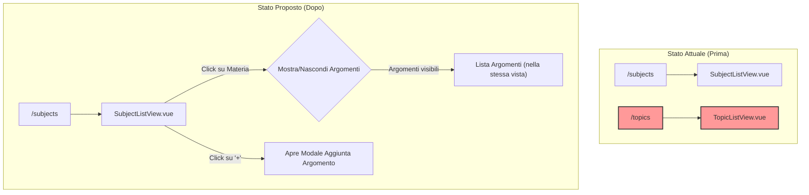

# Piano di Refactoring per la Gestione degli Argomenti

Questo documento descrive il piano per modificare la gestione degli argomenti all'interno del frontend "lessons". L'obiettivo è eliminare la pagina dedicata agli argomenti e integrare la loro gestione direttamente nella vista elenco delle materie, migliorando l'esperienza utente e rendendo il flusso di lavoro più intuitivo.

## Obiettivo

Sostituire la navigazione a due pagine separate (una per le materie, una per gli argomenti) con un'unica vista in cui gli argomenti sono visualizzati come una sezione espandibile sotto ogni materia.

## Diagramma del Flusso (Prima e Dopo)

## Piano di Implementazione

Il lavoro è stato suddiviso nei seguenti passaggi sequenziali:

1.  **Preparazione di `SubjectListView.vue`**: Importare le dipendenze necessarie per la gestione degli argomenti, come `useTopicStore`, il modale `TopicEditModal.vue` e i tipi di dati relativi agli argomenti.

2.  **Modifica Interfaccia in `SubjectListView.vue`**:
    *   Trasformare la tabella delle materie per supportare righe espandibili. Ogni riga di una materia diventerà cliccabile per mostrare/nascondere gli argomenti associati.
    *   Aggiungere un'icona (es. `+`) accanto al nome di ogni materia per l'aggiunta rapida di un nuovo argomento.

3.  **Visualizzazione Argomenti**:
    *   Sotto ogni riga della materia, creare una sezione a comparsa (collapsible) che conterrà la lista degli argomenti.
    *   Questa lista mostrerà gli argomenti filtrati per la materia selezionata.
    *   La logica di recupero e filtraggio degli argomenti verrà migrata da `TopicListView.vue`.

4.  **Aggiunta di un Nuovo Argomento**:
    *   Il click sull'icona `+` aprirà la modale `TopicEditModal`.
    *   La modale dovrà essere pre-compilata con l'ID della materia a cui l'argomento appartiene, rendendo il campo della materia non modificabile o nascosto.

5.  **Modifica ed Eliminazione degli Argomenti**:
    *   All'interno della lista a comparsa, ogni argomento avrà le proprie icone per la modifica e l'eliminazione, replicando la funzionalità attualmente presente in `TopicListView.vue`.
    *   Il click su "modifica" aprirà la `TopicEditModal` con i dati dell'argomento.
    *   Il click su "elimina" chiederà conferma e procederà con la rimozione.

6.  **Pulizia del Codice**:
    *   Una volta che tutte le funzionalità sono state migrate e testate in `SubjectListView.vue`, il file `frontend-lessons/src/views/TopicListView.vue` verrà rimosso.
    *   La rotta `/topics` verrà eliminata dal file del router (`frontend-lessons/src/router/index.ts`).